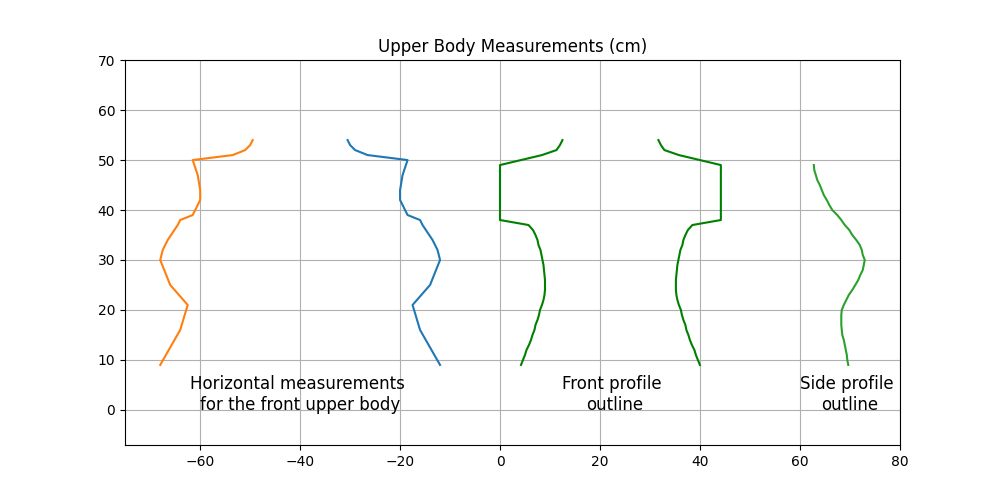
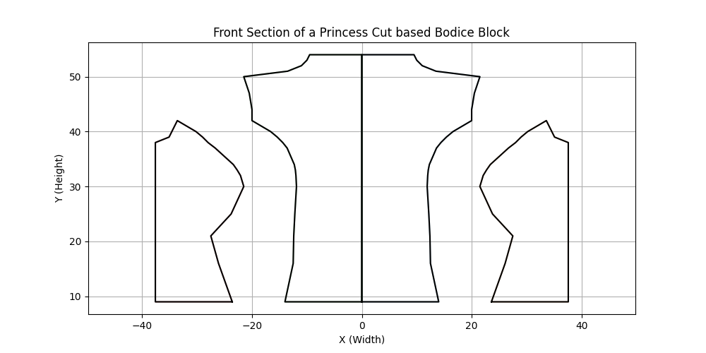

# Pattern Creator

This project creates sewing patterns from body measurements towards an effort to automate patternamking. But this is done without using the patternmaking rules and keeping simple geometric principles as the basis.


## Input
Horizontal measurements for the upper half (front only), spaced 4-5 cm apart are used to create the pattern. Such measurements include neck, underarm, upper bust, under bust, waist etc.  
The profile outlines are provided to give an understanding of the body shape. 



## Output
A fabric cutting pattern is generated based on the input measurements. This can be cut on a flat sheet to create a 3D shape fitting the body.



## Future work
I have only focused on horizontal measurements in this project as of now, but vertical lengths and curvatures play an equaly important role for patternmaking.

But even this reduced scope has allowed me to create a pattern for a larger chest size which many patternmaking techniques don't account for.

Future directions:
- Starting from a 3D shape rather than just a list of horizontal measuremnts
- Explore different cuts/darts, automate finding the right one for a particular shape
- There are tailoring constraints (like two panel edges should be sewn together at 180º) which should be accounted for during pattern creation.

## Local Setup

1. Install Poetry (package manager):
```bash
curl -sSL https://install.python-poetry.org | python3 -
```

2. Install dependencies:
```bash
poetry shell
poetry install
```